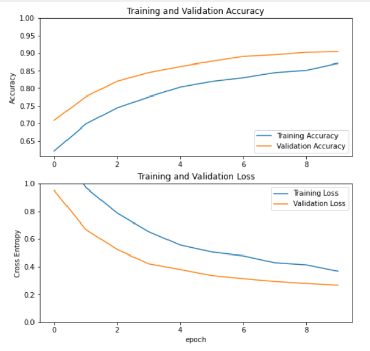

# x-ray 폐렴 진단 프로젝트 - image classification

## 이미지 분류 문제영역 소개

이미지 분류(Image Classification) 문제란 주어진 이미지에 대해 사전에 정해진 레이블(label) 집합의 한 원소를 할당하는 문제이다. 
이 문제는 컴퓨터 비전 영역의 핵심 문제 중 하나로서, 문제의 단순함에도 불구하고 다양한 응용 분야를 가지고 있다.

## 프로젝트의 목적
의료같은 전문지식이 필요한 분야에서는 무엇보다 전문가의 지식과 경험이 중요하다. 이 모든것은 인간의 초월적인 감각에 의존하는 것이 아닌 오로지 데이터에 기반한 학문이라는 것이다.
가령 의료인의 진단process를 머신러닝 관점으로 해석해 본다면, 환자의 상태 및 발현되는 병증 등이 각각의 독립변수이고 그 형태나 정도등이 weights르 적용되며 이러한 데이터를 기반으로 의사는 해당 병명을 유추하게된다.
이번 프로젝트에서 진행하게되는 x-ray 는 시간이 지날수록 기계에 의존적이게 될 것이라 생각한다. 개개인 의사들의 경험과 지식에 의존하던 x-ray 진단 process는 한계가 존재했다.
하지만 딥러닝의 발전으로 의사와 컴퓨터의 융합은 전반적인 x-ray 진단 process를 한층 진화시킬 것이라고 생각한다.
비단 x-ray 뿐만아니라 추후 전체적인 의료계의 혁명을 이끌어낼수 있는 기술이 바로 딥러닝이다.

그림 1 - 코로나 19 감염 이미지 식별 99.4% 검사 정확도의 딥러닝 기술은? - NextDaily [1]

코그넥스의 생명과학 분야 수석 AI 전문가 Vandenhirtz는 "모든 역량에서 딥러닝 알고리즘이 인간 의료진의 지혜를 완전히 대체할 수는 없으며 적어도 단기적으로는 인공지능이 의료 진단을 내릴 수 있을 것으로 생각하지 않는다”라면서 “청진기나 혈압 측정기와 마찬가지로, 딥러닝은 의료 전문가들이 높은 수준에서 그들의 일을 수행할 수 있도록 돕는 유용한 도구가 될 수 있다”고 말했다.

출처 : 넥스트데일리(http://www.nextdaily.co.kr)

그림 2 - 의료 인공지능 '루닛 인사이트' 개발 참여한 서울대병원 영상의학과 박창민 교수
폐암, 폐전이암 진단에 도움 기대 [2]

## TransferLeaning & fine-tune
대량의 x-ray 데이터셋을 구할수 없기 때문에 전이학습을 채택하고 프로젝트를 진행하였습니다.
최상위 fc계층을 제외한 convolution 계층을 고정하고 최상위 분류기 훈련진행 후 고정해제할 계층을 정한 뒤 다시 훈련 진행

그림 3 - fine-tune 진행 [6]

# kaggle chest x-ray Dataset

총 5856장으로 이루어진 kaggle chest x-ray image dataset 활용
부족한 데이터셋을 보충하기위해 데이터 증강 진행

그림 5 - chest x-ray augmentation

전체 5856장의 이미지에서 **총 5,216장의 이미지**를 trian을 위한 이미지로 선별하였습니다. 이중에서 **3875장이 pneumonia 폐 image 로, 1341장이 정상 폐 image로 구성돼 있으며 624장의 test 데이터셋 16장의 validation 데이터셋으로 구성 돼있습니다. 

# Training

vgg16 모델 인스턴스화 후 convolution layer 고정후 분류기 학습을 진행 하였습니다. 

그림 6 - 10번의 훈련을 거친 결과입니다.

# fine-tune
base model 을 훈련할수 있는 계층을 찾은다음 적절하게 고정해제할 층을 선택하고 훈련을 진행합니다.

이 부분은 개인의 노하우인듯 합니다.

저는 맨아래 두번째 pooling 층까지 다시 동결하고 훈련을 진행했습니다.

그림 7 - 이어서 진행한 fine-tune loss and acc

# evaluation
90%에 수렴하던 정확도가 98.75% 까지 상승하였습니다.

# 경험 향유 및 Future Work

전이학습을 진행하면서 CNN 에 대한 이해도가 한층 상승 했습니다.
데이터증강, 각각모델에 맞는 픽셀값 조정 이미지 로딩시간을 줄이기위한 프리페치 등 모델링하기전에 데이터를 어떻게 가공하는지도 매우중요합니다.
full connected layer, convolution layer, maxpool2dlayer, global_average_pooling2d layer의 의미와 역할에 대해 더욱 심도있게 이해하였으며
dropout 및 learning-rate 설정을 통해 학습률을 개선시킬수 있고, 2개의 클래스로 분류하는 모델은 *from_logits=True로 설정하고 BinaryCrossentropy loss 를 사용해야한다는 것을 배웠습니다.
방대한 데이터를 가지고 비슷한 종류의 이미지를 학슴한 모델을 가지고 custom dataset을 가지고 새롭게 학습을 시켜서 높은 정확도(98.75%)를 냈다는 것에 만족합니다.

추후 빅데이터를 접할 기회가 생기면 전이학습이 아닌 다른 딥러닝 모델링으로 처음부터 끝까지 custom dataset 으로 학습을 진행해 보고 싶습니다.
이렇게 개발한 모델을 가지고 flask 와 구글 cloud platform 을 활용하여 서비스화 시킬 계획입니다.
# References

[1] [코로나 19 감염 이미지 식별 99.4% 검사 정확도의 딥러닝 기술은?-넥스트 데일리](http://www.nextdaily.co.kr/news/articleView.html?idxno=97076)

[2] [https://www.kaggle.com/paultimothymooney/chest-xray-pneumonia](https://www.kaggle.com/paultimothymooney/chest-xray-pneumonia)

[3] [https://www.tensorflow.org/guide/keras/transfer_learning?hl=ko](https://www.tensorflow.org/guide/keras/transfer_learning?hl=ko)

[4] [https://www.youtube.com/watch?v=0u5bNeJngDk](https://www.youtube.com/watch?v=0u5bNeJngDk)

[5] [https://www.tensorflow.org/about/case-studies?hl=ko](https://www.tensorflow.org/about/case-studies?hl=ko)

[6] [https://www.tensorflow.org/tutorials/images/transfer_learning?hl=ko](https://www.tensorflow.org/tutorials/images/transfer_learning?hl=ko)

[7] [https://excelsior-cjh.tistory.com/180](https://excelsior-cjh.tistory.com/180)
